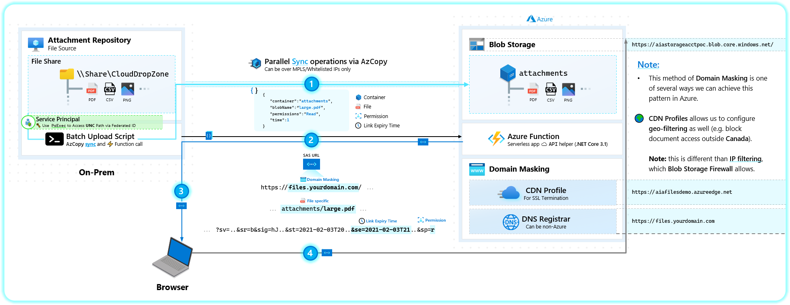

# Cloud Storage - Valet Key Demonstration

End-to-end demonstration of Valet Key Architecture [Pattern](https://docs.microsoft.com/en-us/azure/architecture/patterns/valet-key).

## Overview

This repository demonstrates the following architecture: <br><br>


---

1. Accessing data via [UNC](https://www.lifewire.com/unc-universal-naming-convention-818230#:~:text=The%20Universal%20Naming%20Convention%20is,file%20sharing%20technologies%20like%20Samba.) from an On-Prem [File Share](https://www.techrepublic.com/blog/data-center/how-to-share-a-folder-in-windows-server-2012/) (while impersonating a Service Account via [PsExec](https://docs.microsoft.com/en-us/sysinternals/downloads/psexec)).

   The folder/files at this UNCShare is synced to an Azure Blob Storage via [`azcopy sync`](https://docs.microsoft.com/en-us/azure/storage/common/storage-ref-azcopy-sync) without `--delete-destination` set (we want to archive files on Azure even though On-Prem File Share gets cleaned up).

2. Deploying an Azure Function capable of generating SAS URLs per file, and responding back to the caller.
3. Forwarding the SAS URL to a client (our browser).
4. Accessing stored file via SAS URL for the time duration configured by the caller.

---

## Deployment Steps

1. Install `azcopy` using the script [UploadBlobs\InstallAzCopy.ps1](UploadBlobs\InstallAzCopy.ps1).
2. Install `PsExec` on the same machine to be able to call `uploadbatch.ps1` using the Service Account creds that has access to the File Share (rather than the local user account).
3. Deploy the following Azure Services:

   <br><div style="text-align:left"></div><br>

4. Set up CDN to point to the Storage Account for SAS pass-through [tutorial](https://docs.microsoft.com/en-us/azure/cdn/cdn-sas-storage-support#option-1-using-sas-with-pass-through-to-blob-storage-from-azure-cdn)
5. Set up Custom Domain with CDN for SSL termination: [tutorial](https://docs.microsoft.com/en-us/azure/cdn/cdn-custom-ssl?tabs=option-1-default-enable-https-with-a-cdn-managed-certificate#validate-the-domain)
6. Deploy the code present in [GetSASTokenFunc\HTTPTriggerCSharp.cs](GetSASTokenFunc\HTTPTriggerCSharp.cs) into the Azure Function from VSCode: [tutorial](https://docs.microsoft.com/en-us/azure/azure-functions/create-first-function-vs-code-csharp)
7. Localize the `Custom_Domain` App Settings on the Azure Functions for your environment:

   

8. Grab the **Function URL** from the deployed Function:
   <br><div style="text-align:left"></div>

9. Localize the `# Parameters` of [UploadBlobs\uploadbatch.ps1](UploadBlobs\uploadbatch.ps1) for your setup.
10. Run `uploadbatch.ps1` with the required arguments:

```Powershell
.\uploadbatch.ps1 `
   -uncServer "your-fileshare-server" `
   -fileshare "CloudDropZone" `
   -storageContainerName "attachments" `
   -storageAccountRG "your-storage-rg" `
   -storageAccountName "your-storage-account" `
   -clientSecret "your-service-principal-secret" `
   -appId "your-service-principal-id" `
   -tenantId "your-tenant-id" `
   -functionURL "https://your-azure-function.azurewebsites.net/api/HttpTriggerCSharp?code=your--secret--code--from--azure--portal" `
   -onPremAcctUsername "yourdomain\serviceaccount" `
   -onPremAcctPassword "serviceaccountpassword"
```

We see:


Here we see:

- `uploadbatch.ps1` runs to upload the entire Fileshare (including folder structure)
- For each **file**, a temporary SAS URL is generated, taking into account the folder structure
  - We browse to each SAS URL and compare against the files copied
- Next time `uploadbatch.ps1` runs (not shown), it will only copy deltas from the Fileshare into Azure Storage

Once **1 minute** expires (we set this when calling the Azure Function) and we attempt to browse to/refresh our previously working SAS URL, we'll be met with this:


At which point, the SAS URL must be generated again.
